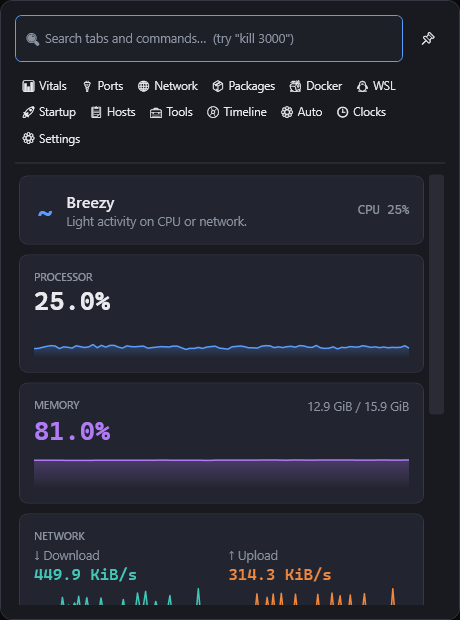
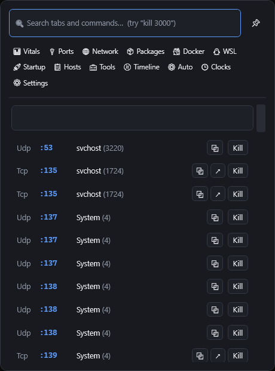
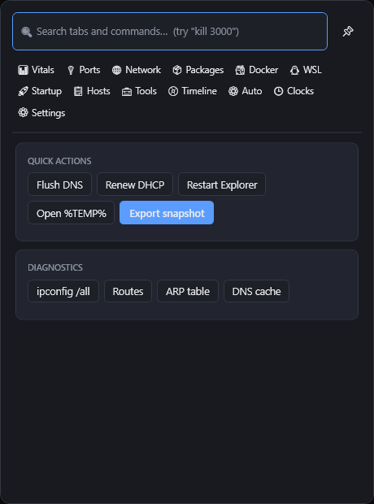
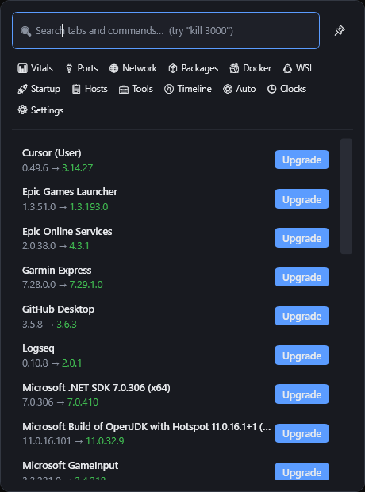

# DevBar for Windows

**The system tray, built for developers.**
System vitals, listening ports, Docker, WSL, winget, network diagnostics, automations — one click or one hotkey from anywhere.


A Windows counterpart to [backquant/mac-devbar](https://github.com/backquant/mac-devbar), rebuilt natively in C#/WPF with the Windows-specific tools a dev box actually needs.

<p align="center">
  
</p>

```
> devbar ports
TCP  0.0.0.0         :3000   node (18244)
TCP  0.0.0.0         :5432   postgres (9120)
UDP  0.0.0.0         :5353   chrome (7788)

> devbar kill 3000
node (pid 18244): Killed

> devbar export -o snapshot.json
Snapshot written to snapshot.json
```

Most Windows monitors show you a graph and stop there. DevBar is built around *doing something about it*: the port list has a Kill button, the Docker row has restart, the hosts file has a toggle, and everything is reachable four ways — tray click, global hotkey (<kbd>Ctrl</kbd>+<kbd>Alt</kbd>+<kbd>D</kbd>), `devbar://` deep links, and the bundled CLI.

---

## Install

**Build from source** — requires the [.NET 10 SDK](https://dotnet.microsoft.com/download). The repo pins `nuget.org` in `NuGet.Config`, so restore works regardless of machine-wide NuGet settings.

```bash
dotnet run --project src/DevBar
```

**Or produce an installer** (needs [Inno Setup 6+](https://jrsoftware.org/isinfo.php)) — per-user, no admin required; registers the `devbar://` scheme and puts `devbar` on your PATH:

```bash
dotnet publish src/DevBar -c Release -r win-x64 --self-contained -o publish/app
```

```bash
dotnet publish src/DevBar.Cli -c Release -r win-x64 --self-contained -o publish/cli
```

```bash
iscc installer/devbar.iss
```

---

## What's in it

### Vitals

The tray icon itself is a live CPU% readout. The Vitals tab expands that into **machine weather** — the whole picture in one glyph (`·` calm, `~` breezy, `≈` busy, `⚡` stormy) — plus big-number CPU and memory stats with ~3-minute sparkline history, per-direction network throughput graphs, drive usage, and a machine card (host, CPU model, OS, arch) with copy buttons. Weather shifts are logged to the Timeline, so you can see when the storm started.

GPU load, temperatures, and fan RPM appear when available — they need admin, and DevBar hides them rather than showing a fake `0°C`.

### Ports



Every listening TCP and UDP socket — IPv4 **and** IPv6, so dev servers that bind `::` don't hide — with the owning process and PID. Dev-stack processes (node, vite, python, dotnet, docker, postgres…) rank above system noise.

Per row: **copy** the port number, **open** `localhost:<port>` in your browser, or **Kill**. The search box doubles as a command palette — type `kill 3000` and press Enter.

Kills that hit an access-denied wall tell you so instead of failing silently.

<br clear="right" />

### Tools



One-click fixes for the small daily annoyances: **Flush DNS**, **Renew DHCP**, **Restart Explorer** (for the frozen-taskbar days), and **Open %TEMP%**.

Diagnostics presets (`ipconfig /all`, routes, ARP table, DNS cache) run and show raw output inline — no terminal window hunting.

**Export snapshot** saves vitals + ports + network state as JSON, for bug reports or before-and-after comparisons. Also available as `devbar export`.

<br clear="right" />

### Packages



Your `winget upgrade` list with per-package upgrade buttons — Homebrew's role on the mac original, played by the package manager Windows already ships.

<br clear="right" />

### Docker & WSL

Containers with state dots and start / stop / restart. WSL distros with their running state — open a terminal into one, terminate it, or `wsl --shutdown` the lot. Both tabs degrade to a plain "not available" note when the tools aren't installed.

### Startup & Hosts

**Startup** toggles the same `StartupApproved` registry values Task Manager uses, so state stays in sync with the Startup tab — covering HKCU/HKLM Run keys and the Startup folder. **Hosts** is the usual "point `app.local` at 127.0.0.1" workflow: add, toggle, and remove entries, elevating only for the actual write.

### Automations & Timeline

Rules like *when port 3000 opens → notify / run a command / kill it*, stored as plain JSON. The Timeline is a rolling log of ports opening and closing, kills, Docker actions, automation firings, and machine-weather shifts — useful for "what happened while I was at lunch" debugging.

### Clocks, palette, pin

Multiple time zones at a glance. The search box filters tabs and quick actions (`Flush DNS`, `Export snapshot`, `kill <port>`) — <kbd>Enter</kbd> runs the first hit, <kbd>Esc</kbd> closes. The 📌 pin keeps the popup open while you work elsewhere.

---

## CLI

Commands talk to the running tray app over a named pipe (warm data, instant answers) and fall back to reading the system directly when it isn't running:

```bash
devbar ports
```

```bash
devbar kill 3000
```

```bash
devbar export -o snapshot.json
```

Also available: `devbar vitals`, `devbar wsl list`, and `devbar open <tab>` to focus the popup on any tab.

## Deep links

`devbar://` URIs work from a browser, a script, or the Run dialog:

| URI | Action |
| --- | --- |
| `devbar://open/ports` | Open the popup on a tab (any tab key works) |
| `devbar://kill/3000` | Kill whatever is listening on port 3000 — **after you confirm** |

Because any webpage can launch a `devbar://` URI, kill links always show a confirmation dialog listing the affected processes first. CLI kills run directly — you typed those yourself.

## Security notes

- **IPC is same-user only.** The named pipe uses `PipeOptions.CurrentUserOnly`: other local accounts and remote clients cannot connect, so nothing outside your session can kill processes or read port lists through DevBar.
- **Deep-link kills require confirmation** — browsers cannot trigger a kill silently.
- **Hosts entries are validated.** Hostnames are restricted to characters that cannot break the hosts-file format, so a paste with hidden whitespace can't corrupt the system file or smuggle in extra entries.
- **No elevation by default.** The UAC prompt appears only for the specific operations that need it (hosts-file writes), never for the app as a whole. Running the whole tray app as administrator would make every dev server you launch from it inherit those rights.

## Architecture

```
src/DevBar.Core    All OS interaction — no UI dependencies, unit-tested
src/DevBar         WPF tray app (H.NotifyIcon + CommunityToolkit.Mvvm)
src/DevBar.Cli     `devbar` console tool
tests/             xUnit tests over the Core parsers and diff logic
installer/         Inno Setup script
```

A few decisions worth knowing:

- **Ports** come from `GetExtendedTcpTable`/`GetExtendedUdpTable` rather than `netstat` parsing or `IPGlobalProperties` — it's the only route that gives a PID per port, and it's what TCPView uses.
- **Sampling** runs off the UI thread on one shared timer; failures are written to the Timeline rather than swallowed, so a broken sampler is visible instead of silently freezing the display.
- **The tray icon** is rasterized text redrawn per sample, with the previous GDI handle explicitly destroyed — no handle leak at one icon per refresh.
- **Settings and automation rules** live in `%APPDATA%\DevBar` as plain JSON — easy to inspect, diff, or delete.

## Development

```bash
dotnet build DevBar.slnx
```

```bash
dotnet test
```

Tests cover the parsing and matching logic that's easy to get subtly wrong: winget's fixed-width table, `wsl -l -v` output, hosts-file round-tripping, hostname validation, deep-link mapping, and port-change diffing.

## License

MIT — see [LICENSE](LICENSE).
